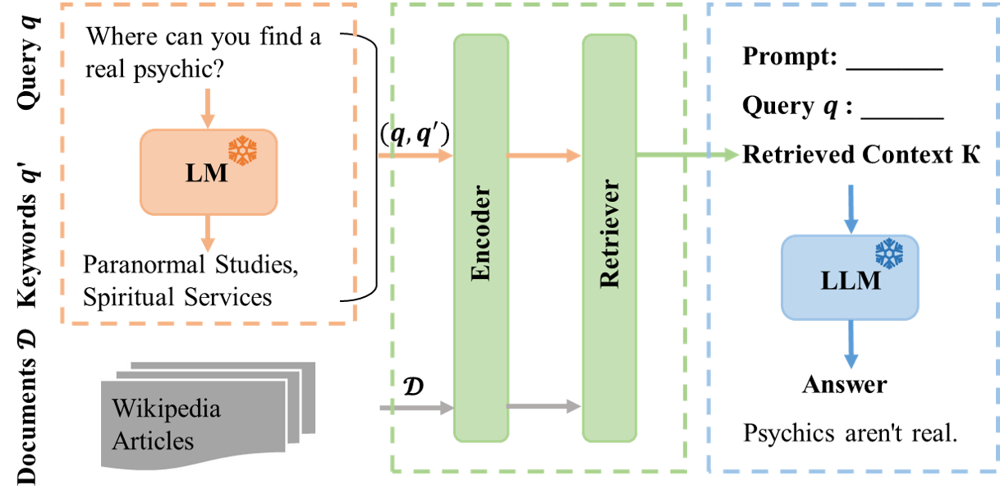

# RAG Best Practices

This repository is the official implementation of the paper [Enhancing Retrieval-Augmented Generation: A Study of Best Practices](https://github.com/ali-bahrainian/RAG_best_practices)

## Overview
This repository implements a **Retrieval-Augmented Generation (RAG)** system to assess the impact of various RAG components and configurations individually. The framework expands user queries, retrieves relevant contexts, and generates responces using a Large Language Model (LLM).

The RAG framework combines:
1. **Query Expansion Module**: Expands the query using a language model (LM).
2. **Retrieval Module**: Retrieves similar documents or sentences.
3. **Generative LLM**: Generates the final answer based on the retrieved contexts.

<p align="center">
  
</p>

---
## Configuration
This project provides a flexible configuration system to customize the RAG system. Key settings include:
```bash
base_config = {
    # Language Model Settings
    "generation_model_name": "mistralai/Mistral-7B-Instruct-v0.2",  # 7B-parameter instruction-tuned LLM
    "embedding_model_name": "sentence-transformers/all-MiniLM-L6-v2",  # Model for document embeddings
    "seq2seq_model_name": "google/flan-t5-small",  # Small T5 model for query expansion
    "is_chat_model": True,  # Indicates if the model follows chat-based input/output

    # Prompt Design
    "instruct_tokens": ("[INST]", "[/INST]"),  # Instruction tokens to guide the LLM

    # Document Indexing and Chunking
    "index_builder": {
        "tokenizer_model_name": None,  # Defaults to the embedding model tokenizer
        "chunk_size": 64,              # Number of tokens per document chunk
        "overlap": 8,                  # Overlap of tokens between chunks for context continuity
        "passes": 10,                  # Number of document passes for indexing
        "icl_kb": False,               # Contrastive In-Context Learning knowledge base (disabled)
        "multi_lingo": False           # Multilingual knowledge base support (disabled)
    },

    # Retrieval-Augmented Language Model (RALM) Settings
    "ralm": {
        "expand_query": False,         # Query expansion techniques (disabled)
        "top_k_docs": 2,               # Top-2 documents retrieved for relevance
        "top_k_titles": 7,             # Top-7 titles retrieved for Step 1 retrieval
        "system_prompt": ......,       # System prompt for generating responses
        "repeat_system_prompt": True,  # Repeat system prompt to guide generation
        "stride": -1,                  # Retrieval stride: -1 means no fixed stride
        "query_len": 200,              # Maximum query length in tokens
        "do_sample": False,            # Disable sampling for deterministic outputs
        "temperature": 1.0,            # Control randomness in generation
        "top_p": 0.1,                  # Nucleus sampling: considers tokens in top-10% probability mass
        "num_beams": 2,                # Number of beams for beam search
        "max_new_tokens": 25,          # Limit the number of generated tokens
        "batch_size": 8,               # Batch size for processing
        "kb_10K": False,               # 10K knowledge base support (disabled)
        "icl_kb": False,               # ICL knowledge base support (disabled)
        "icl_kb_incorrect": False,     # Incorrect ICL knowledge base (disabled)
        "focus": False                 # Focus mode for sentence-level retrieval (disabled)
    }
}

```

---
## Installation
1. **Clone mixtral-offloading repository**:
   ```bash
   git clone https://github.com/dvmazur/mixtral-offloading.git
   ```
2. **Download the Mixtral-8x7B Mode**:
    ```bash
    huggingface-cli download lavawolfiee/Mixtral-8x7B-Instruct-v0.1-offloading-demo --quiet --local-dir Mixtral-8x7B-Instruct-v0.1-offloading-demo
    ```
3. **Install Dependencies**:
    ```bash
    pip install -r requirements.txt
    ```
4. **Download Knowledge Sources**:

    Download the necessary knowledge base files from the provided [Google Drive link](https://drive.google.com/drive/folders/1_-2PHI0-Wz1VjnW5Yvy5Ne9C7mMWk1nf?usp=drive_link).
    
    Unzip the downloaded files into the `resources/` directory.
---

## Project Structure
Your final directory structure should look like this:
```
RAG_best_practices/ 
│
│ ├── mixtral-offloading/                                # Mixtral model offloading library
│ ├── Mixtral-8x7B-Instruct-v0.1-offloading-demo/        # Mixtral-8x7B model offloading library
│
├── model/                       # Core RAG implementation 
│ ├── index_builder.py           # Builds document index 
│ ├── language_model.py          # Setting LLM to generate text
│ ├── model_loader.py            # Loads Mixtral LLM 
│ ├── rag.py                     # Main RAG pipeline 
│ ├── retriever.py               # Retrieves documents 
│ ├── config.py                  # Configuration setup 
│ ├── evaluation.py              # Runs the full RAG pipeline 
│ ├── requirements.txt           # Python dependencies 
│
├── resources/                   # Knowledge base
│ ├── articles_l3.pkl            # Knowledge base file (level 3)
│ ├── articles_l4.pkl            # Knowledge base file (level 4)
└── README.md 
```

---

## Run RAG System 
To evaluate our RAG system with different configurations, simply run:

```bash
python evaluation.py
```
---

## Citation
If you find our paper or code helpful, please cite our paper:
```
@inproceedings{title={Enhancing Retrieval-Augmented Generation: A Study of Best Practices}}
```